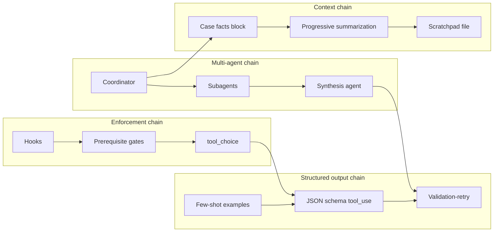

# Concept Map — All 30 Tasks

Ultra-concise takeaways from the exam guide (pp. 4–24).

## Domain 1 — Agentic Architecture (27%)

| Task | Concepts (3–5 words each) |
|------|---------------------------|
| **1.1** | `stop_reason` loop control · tool_result append · model-driven tools · avoid arbitrary caps |
| **1.2** | Hub-and-spoke coordinator · isolated subagent context · decompose/delegate/route · iterative refinement |
| **1.3** | Task tool spawn · explicit context pass · AgentDefinition · fork_session · goals not steps |
| **1.4** | Hooks vs prerequisite gates · programmatic enforcement · structured handoff · parallel investigate |
| **1.5** | PostToolUse normalize · intercept outgoing calls · hooks for compliance |
| **1.6** | Prompt chaining vs adaptive · per-file then integration · evidence-driven debugging |
| **1.7** | `--resume` named sessions · fork_session branches · stale results → fresh session |

## Domain 2 — Tool Design & MCP (18%)

| Task | Concepts |
|------|----------|
| **2.1** | Descriptions drive selection · split generic tools · audit keyword routing |
| **2.2** | `isError` structured errors · retryable metadata · empty ≠ error |
| **2.3** | Scoped tool sets · `tool_choice` forced first · synthesis gets `verify_fact` |
| **2.4** | `.mcp.json` vs `~/.claude.json` · MCP resources as catalogs |
| **2.5** | Grep content · Glob paths · Read→Write fallback · wrapper alias grep |

## Domain 3 — Claude Code Config (20%)

| Task | Concepts |
|------|----------|
| **3.1** | CLAUDE.md hierarchy · `@import` modular · `/memory` diagnose |
| **3.2** | Slash commands vs skills · `context: fork` · `allowed-tools` · `argument-hint` |
| **3.3** | `.claude/rules/` glob paths · conditional convention loading |
| **3.4** | Plan mode = architecture · Explore subagent · plan then execute |
| **3.5** | I/O examples · test-driven iteration · interview pattern · linked fixes batch |
| **3.6** | `-p` non-interactive · `--output-format json` · independent review instance |

## Domain 4 — Prompt & Structured Output (20%)

| Task | Concepts |
|------|----------|
| **4.1** | Explicit criteria · skip vague “be conservative” · severity examples |
| **4.2** | Few-shot for format/judgment · generalizes to novel cases |
| **4.3** | `tool_use` + JSON schema · `strict` syntax not semantics · `other` + detail |
| **4.4** | Retry with validation errors · `detected_patterns` · calculated vs stated totals |
| **4.5** | Batch 50% off · 24h window · no SLA · `custom_id` · no in-request tool loop |
| **4.6** | Independent review instance · multi-pass · self-reported confidence routing |

## Domain 5 — Context & Reliability (15%)

| Task | Concepts |
|------|----------|
| **5.1** | Progressive summarization · lost-in-middle · trim tool fields · case facts block |
| **5.2** | Policy gaps escalate · clarify multi-match · no heuristic ID pick |
| **5.3** | Structured error propagation · coverage annotations · empty ≠ suppress error |
| **5.4** | Scratchpad files · subagent delegation · state manifests · `/compact` |
| **5.5** | Stratified sampling · field-level calibrated confidence · segment accuracy |
| **5.6** | Claim-source mappings · contested vs established · coordinator reconciles conflicts |

---

## Correlation graph

### Related concept clusters

| Cluster | Members | Exam tie-in |
|---------|---------|-------------|
| **Deterministic compliance** | Hooks, prerequisite gates, `tool_choice` forced | Identity lookup before refund |
| **Tool contracts** | Split tools, descriptions, schemas | Generic tool type mismatches |
| **Coordinator pattern** | Hub-and-spoke, explicit context, synthesis downstream | Narrow decomposition; scoped synthesis tools |
| **Context durability** | Messages array, scratchpad, summarization, manifests | Multi-issue chats; long exploration sessions |
| **Confidence types** | Self-reported (unreliable) vs field-level calibrated (5.5) | Task 4.6 vs 5.5 distinction |
| **Exploration** | Grep→Read trace, adaptive decomposition, Explore subagent | Wrapper tracing; unknown bug paths |

---

## Tradeoff table (recurring exam forks)

| Decision | Option A | Option B | When A wins | When B wins |
|----------|----------|----------|-------------|-------------|
| Long multi-issue chat | Progressive summarization | Structured issue data layer | Narrative continuity matters | Pure transactional facts suffice |
| Context near limit | Summarize resolved threads | Sliding window last N turns | Customer returns to old topic | Only recent topic matters |
| Tool design | Purpose-specific tools + schemas | Generic tool + enum mode | Output type must be reliable | Single trivial operation |
| Format messy sources | Schema + normalization in prompt | Post-processing code | Extraction-time canonical format | Simple deterministic transforms |
| Workflow ordering | Programmatic enforcement | Prompt instructions only | Financial/compliance stakes | Low-risk guidance |
| Customer ID ambiguity | Ask for more identifiers | Heuristic / confidence threshold | Always for multi-match | Never for identity |
| Escalation | Structured handoff brief | Dump full history / immediate escalate | Mid-process with investigation | Zero context + anger → one question |
| Debugging unknown path | Adaptive subtasks per finding | Fixed plan or parallel layers | Open-ended bugs | Known pipeline steps |
| Long code exploration | Scratchpad file | Bigger model / periodic clear | 30+ min sessions | Short scoped task |
| Structured output (production) | `output_config.format` | `tool_use` + `strict: true` | Final JSON answer | Agent loop / real actions |
| Batch vs sync API | Message Batches API | Synchronous Messages API | Overnight/weekly, 24h OK | Pre-merge blocking checks |
| Review quality | Independent second instance | Self-critique same session | Subtle issues (4.6) | Quick completeness check |
| Coordinator design | Research goals + quality criteria | Step-by-step procedure | Subagent adaptability | Fully deterministic script |

---

## Guide page quick lookup

See the [official exam guide (Anthropic Academy)](https://anthropic.skilljar.com/claude-certified-architect-foundations-access-request) for the full task index.
